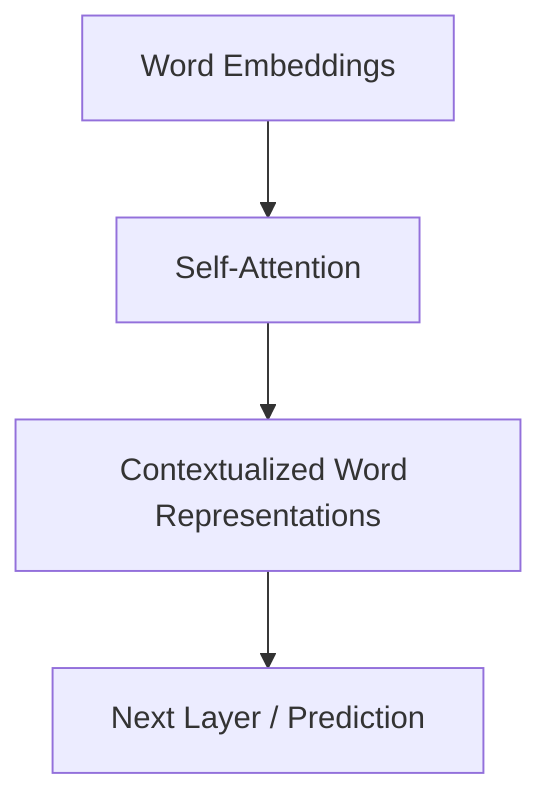

# Implemeantation Of Attention Transformer

An Attention Encoder basically alters the word embeddings (which are vector representations of words) to create contextualized representations.

It uses a mechanism called self-attention, where each word looks at the other words in the sequence and their relationships, and uses this information to modify its representation.



The main mechanizim behind self-attention is the function below.

### Scaled Dot-Product Attention

This function computes the attention scores by taking the dot product of the Queries and Keys, scaling them by the square root of the dimension, and applying a softmax function before multiplying by the Values.

#### Code

```python
def ScaledDotProductAttention(Q: NDArray, K: NDArray, V: NDArray, d: float) -> NDArray:
    output = Q @ K.T
    output = output / np.sqrt(d) # Attention Scores
    output = softmax(output)
    output = output @ V

    return output
```

#### Math expression
```
Attention(X) = softmax((QKᵀ) / √dₖ) V
```


We have 3 matrixs that are abstracted into

Q: Query,
K: Key,
V: Value

We will train the network to form our Q K V matrixs.

in forward pass Q and K are dot producted. (QKᵀ)
Since Q is meant to be Query, and K is Key. If they are related to each other(If vectors are looking at the same way), result of the dot product will be closer to 1.
They called this attention scores. in a flat vector that has a spot for every word in our sentence we are resulted with a matrix that has values in 0-1 range(softmax puts them in this range).

We multiply this with the Value matrix, which is supposed to be the inherent word meaning related matrix.
Which gives us a modified Value matrix with a bias toward relational strengths in our sentence.

We train the network until our QKV matrixs are closer the their optimal set of values.


### Multihead Attention

This is done so we can train the network for more depth in our sentences (Vocabulary, Tone, Emotion etc).

It is the same operation but for multiple QKV matrixs. For each head we train a separate QKV then concatinate them in the output like below.

[[Attention(X1)], [Attention(X2], [Attention(X3], [Attention(X4],]

One thing to note here, make sure the output of this function will be same dimensions as embed dimensions. Each attention should output Embed dim / Head Count. But this advice is probably never going to be of use since no one will implemeant this function again probably.

## References

* Vaswani, A., Shazeer, N., Parmar, N., Uszkoreit, J., Jones, L., Gomez, A. N., Kaiser, Ł., & Polosukhin, I. (2023). **[Attention Is All You Need](https://arxiv.org/abs/1706.03762)**. *arXiv preprint arXiv:1706.03762*.